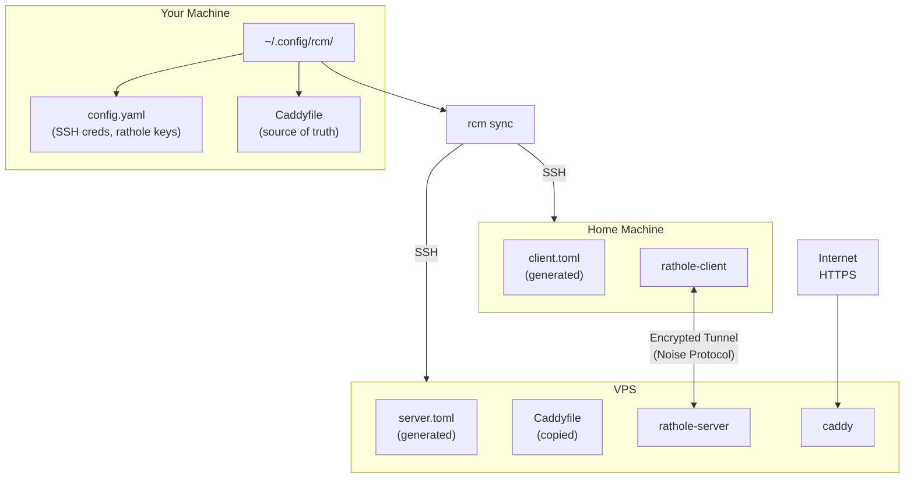

# RCM - Rathole Caddy Manager

A CLI tool that simplifies managing [Rathole](https://github.com/rapiz1/rathole) tunnels with [Caddy](https://caddyserver.com/) reverse proxy. Uses your **Caddyfile as the single source of truth** - just edit one file and RCM handles the rest.

> **Prerequisites:** This tool requires a working Rathole + Caddy setup. See **[rathole-tunnel](https://github.com/AhmedAburady/rathole-tunnel)** for the complete setup guide.



## The Problem

When exposing home network services through a VPS using Rathole + Caddy, adding a new service requires editing **3 config files across 2 machines**:

1. `server.toml` on VPS (rathole server)
2. `client.toml` on home machine (rathole client)
3. `Caddyfile` on VPS (reverse proxy)

This is error-prone and tedious.

## The Solution

RCM lets you manage everything from a single Caddyfile:

```caddyfile
# myapp: 192.168.1.100:3000
app.example.com {
    reverse_proxy 127.0.0.1:5000 { ... }
}
```

Then just run:
```bash
rcm sync
```

RCM will:
1. Parse the Caddyfile to extract service definitions
2. Generate `server.toml` and `client.toml`
3. SSH to both machines and deploy the configs
4. Restart rathole and caddy services

## Installation

### Option 1: uv (Recommended)

```bash
# Install directly from GitHub
uv tool install "rcm @ git+ssh://git@github.com/AhmedAburady/rcm.git"

# Or clone and install locally
git clone https://github.com/AhmedAburady/rcm.git
cd rcm
uv tool install .
```

### Option 2: Docker

```bash
git clone https://github.com/AhmedAburady/rcm.git
cd rcm
docker build -t rcm .

# Run with Docker
docker run --rm -v ~/.config/rcm:/config:ro -v ~/.ssh:/ssh:ro rcm list
```

## Configuration

### 1. Create config directory

```bash
mkdir -p ~/.config/rcm
cp config/config.yaml.example ~/.config/rcm/config.yaml
cp config/Caddyfile.example ~/.config/rcm/Caddyfile
```

### 2. Edit config.yaml

```yaml
# Paths
paths:
  caddyfile: "~/.config/rcm/Caddyfile"
  ssh_dir: "~/.ssh"

# VPS (Server) SSH Configuration
server:
  host: "203.0.113.50"              # Your VPS IP
  user: "root"
  ssh_key: "id_ed25519"             # SSH key filename
  rathole_config: "/etc/rathole/server.toml"
  caddyfile: "~/rathole-caddy/caddy/Caddyfile"
  caddy_compose_dir: "~/rathole-caddy/caddy"

# Home (Client) SSH Configuration
client:
  host: "192.168.1.10"              # Home machine IP (or hostname)
  user: "pi"
  ssh_key: "id_ed25519"
  rathole_config: "/etc/rathole/client.toml"

# Rathole keys
rathole:
  bind_port: 2333
  token: "your-token-here"          # openssl rand -base64 32
  server_private_key: "..."         # From: rathole --genkey
  server_public_key: "..."          # From: rathole --genkey
```

### 3. Edit your Caddyfile

Add a comment before each domain block:

```caddyfile
# service_name: local_ip:port
```

Example:
```caddyfile
# homeassistant: 192.168.1.10:8123
ha.example.com {
    tls /certs/cert.pem /certs/key.pem
    reverse_proxy 127.0.0.1:5001 {
        header_up Host {host}
        header_up X-Real-IP {remote_host}
        header_up X-Forwarded-For {remote_host}
        header_up X-Forwarded-Proto {scheme}
    }
}
```

The VPS port (`5001`) is extracted from `reverse_proxy 127.0.0.1:5001`.

## Usage

```bash
# List services (compares local and remote Caddyfiles)
rcm list
rcm list --plain         # Plain text output

# Pull Caddyfile from remote VPS to local
rcm pull

# Preview what would be deployed (dry-run)
rcm sync --dry-run

# Deploy configs to both machines
rcm sync

# Check tunnel status
rcm status

# Restart services
rcm restart              # Both VPS and client
rcm restart --server     # VPS only
rcm restart --client     # Client only
```

## Features

### Service Comparison
`rcm list` shows which services exist locally vs remotely:

```
┏━━━━━━━━━━━━━━━┳━━━━━━━━━━━━━━━━━━━━┳━━━━━━━━━━┳━━━━━━━━━━━━━━━┳━━━━━━━┳━━━━━━━━┓
┃ Service       ┃ Local Address      ┃ VPS Port ┃ Domains       ┃ Local ┃ Remote ┃
┡━━━━━━━━━━━━━━━╇━━━━━━━━━━━━━━━━━━━━╇━━━━━━━━━━╇━━━━━━━━━━━━━━━╇━━━━━━━╇━━━━━━━━┩
│ homeassistant │ 192.168.1.10:8123  │ 5001     │ ha.example.com│ ✓     │ ✓      │
│ newservice    │ 192.168.1.50:3000  │ 5002     │ new.example.co│ ✓     │ ✗      │
└───────────────┴────────────────────┴──────────┴───────────────┴───────┴────────┘
```

### Auto-Pull on New Machine
When running `rcm sync` without a local Caddyfile, it automatically pulls from remote:

```bash
$ rcm sync
No local Caddyfile found.
Pulling Caddyfile from remote VPS...
✓ Caddyfile synced from remote to ~/.config/rcm/Caddyfile
  Found 8 services

Edit the local Caddyfile and run 'rcm sync' again to deploy changes.
```

### Service Removal Warning
When syncing would remove services, RCM asks for confirmation:

```bash
$ rcm sync
Parsed 7 services from Caddyfile

Warning: The following 1 service(s) will be removed:
  - oldservice

Continue with sync? [y/N]:
```

## Workflow

1. **First time?** Run `rcm sync` or `rcm pull` to get the remote Caddyfile
2. **Edit your local Caddyfile** - add/remove service blocks with comments
3. **Run `rcm sync`** - deploys everything automatically
4. **Done!**

## Caddyfile Format Reference

### Basic service
```caddyfile
# servicename: 192.168.1.100:8080
domain.com {
    reverse_proxy 127.0.0.1:5000 { ... }
}
```

### HTTPS backend (self-signed certs)
```caddyfile
# portainer: 192.168.1.50:9443
portainer.example.com {
    reverse_proxy https://127.0.0.1:5002 {
        transport http {
            tls_insecure_skip_verify
        }
        ...
    }
}
```

### Multiple domains, same service
```caddyfile
# blog: 192.168.1.100:8080
blog.example.com {
    reverse_proxy 127.0.0.1:5003 { ... }
}

# blog: 192.168.1.100:8080
www.blog.example.com {
    reverse_proxy 127.0.0.1:5003 { ... }
}
```

Only one rathole tunnel is created - RCM deduplicates by service name.

## Upgrading

```bash
# If installed via uv
uv tool upgrade rcm --reinstall

# If installed from local clone
cd rcm
git pull
uv tool upgrade rcm --reinstall
```

## License

MIT
